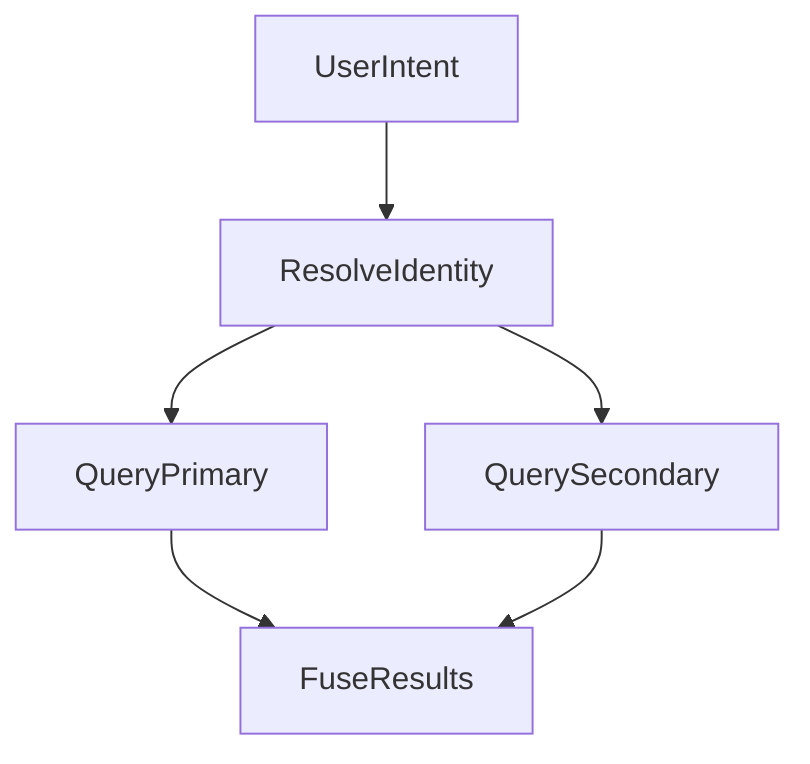

# AI-Native Data Platform Implementation Plan

> **For Claude:** REQUIRED SUB-SKILL: Use superpowers:executing-plans to implement this plan task-by-task.

**Goal:** Build an AI-native data interaction platform that exposes database capabilities to LLMs for natural language data exploration.

**Architecture:** Three-layer design with static semantic layer (YAML configs), dynamic metadata layer (data profiles, insights, query patterns), and unified data access layer supporting PostgreSQL, Qdrant, Neo4j, and InfluxDB. LLM abstraction via LiteLLM.

**Tech Stack:** Python 3.11+, Pydantic, LiteLLM, asyncpg, qdrant-client, neo4j, influxdb-client, FastAPI, PyYAML

---

## Phase 1: Project Foundation

### Task 1: Initialize Project Structure

**Files:**
- Create: `pyproject.toml`
- Create: `src/agent_db/__init__.py`
- Create: `src/agent_db/py.typed`
- Create: `tests/__init__.py`
- Create: `.gitignore`

**Step 1: Create pyproject.toml**

```toml
[project]
name = "agent-db"
version = "0.1.0"
description = "AI-Native Data Interaction Platform"
requires-python = ">=3.11"
dependencies = [
    "pydantic>=2.0",
    "pyyaml>=6.0",
    "litellm>=1.0",
    "asyncpg>=0.29",
    "qdrant-client>=1.7",
    "neo4j>=5.0",
    "influxdb-client>=1.40",
    "fastapi>=0.109",
    "uvicorn>=0.27",
]

[project.optional-dependencies]
dev = [
    "pytest>=8.0",
    "pytest-asyncio>=0.23",
    "pytest-cov>=4.1",
    "ruff>=0.1",
    "mypy>=1.8",
]

[build-system]
requires = ["hatchling"]
build-backend = "hatchling.build"

[tool.hatch.build.targets.wheel]
packages = ["src/agent_db"]

[tool.pytest.ini_options]
asyncio_mode = "auto"
testpaths = ["tests"]

[tool.ruff]
line-length = 100
target-version = "py311"

[tool.mypy]
python_version = "3.11"
strict = true
```

**Step 2: Create package init file**

Create `src/agent_db/__init__.py`:
```python
"""AI-Native Data Interaction Platform."""

__version__ = "0.1.0"
```

**Step 3: Create py.typed marker**

Create empty `src/agent_db/py.typed`

**Step 4: Create tests init**

Create empty `tests/__init__.py`

**Step 5: Create .gitignore**

```
__pycache__/
*.py[cod]
*$py.class
.venv/
venv/
.env
*.egg-info/
dist/
build/
.pytest_cache/
.mypy_cache/
.ruff_cache/
.coverage
htmlcov/
```

**Step 6: Initialize git and commit**

```bash
git init
git add .
git commit -m "chore: initialize project structure"
```

---

## Phase 2: Static Semantic Layer

### Task 2: Define Core Schema Models

**Files:**
- Create: `src/agent_db/semantic/__init__.py`
- Create: `src/agent_db/semantic/models.py`
- Create: `tests/semantic/__init__.py`
- Create: `tests/semantic/test_models.py`

**Step 1: Write failing tests for Entity model**

Create `tests/semantic/test_models.py`:
```python
"""Tests for semantic layer models."""

import pytest
from agent_db.semantic.models import (
    Entity,
    Attribute,
    EntityState,
    Lifecycle,
    SemanticType,
    AttributeSemanticType,
    EnumValue,
)


class TestEntity:
    def test_entity_basic_creation(self):
        entity = Entity(
            name="user",
            table="users",
            description="System users",
            semantic_type=SemanticType.ACTOR,
        )
        assert entity.name == "user"
        assert entity.table == "users"
        assert entity.semantic_type == SemanticType.ACTOR

    def test_entity_with_lifecycle(self):
        lifecycle = Lifecycle(
            created="created_at",
            updated="updated_at",
            deleted="deleted_at",
        )
        entity = Entity(
            name="user",
            table="users",
            description="System users",
            semantic_type=SemanticType.ACTOR,
            lifecycle=lifecycle,
        )
        assert entity.lifecycle.created == "created_at"

    def test_entity_with_states(self):
        states = [
            EntityState(name="active", condition="last_login_at > NOW() - INTERVAL '30d'"),
            EntityState(name="dormant", condition="last_login_at < NOW() - INTERVAL '30d'"),
        ]
        entity = Entity(
            name="user",
            table="users",
            description="System users",
            semantic_type=SemanticType.ACTOR,
            states=states,
        )
        assert len(entity.states) == 2
        assert entity.states[0].name == "active"


class TestAttribute:
    def test_attribute_basic(self):
        attr = Attribute(
            column="subscription_tier",
            semantic_type=AttributeSemanticType.DIMENSION,
        )
        assert attr.column == "subscription_tier"
        assert attr.semantic_type == AttributeSemanticType.DIMENSION

    def test_attribute_with_enum(self):
        enum_values = [
            EnumValue(value="free", meaning="Free user with limits", business_priority="low"),
            EnumValue(value="pro", meaning="Paid user", business_priority="high"),
        ]
        attr = Attribute(
            column="subscription_tier",
            semantic_type=AttributeSemanticType.DIMENSION,
            enum_values=enum_values,
        )
        assert len(attr.enum_values) == 2
        assert attr.enum_values[0].value == "free"
```

**Step 2: Run tests to verify they fail**

```bash
pytest tests/semantic/test_models.py -v
```
Expected: FAIL with import errors

**Step 3: Implement models**

Create `src/agent_db/semantic/__init__.py`:
```python
"""Static semantic layer for schema definitions."""

from agent_db.semantic.models import (
    Entity,
    Attribute,
    EntityState,
    Lifecycle,
    SemanticType,
    AttributeSemanticType,
    EnumValue,
)

__all__ = [
    "Entity",
    "Attribute",
    "EntityState",
    "Lifecycle",
    "SemanticType",
    "AttributeSemanticType",
    "EnumValue",
]
```

Create `src/agent_db/semantic/models.py`:
```python
"""Core models for static semantic layer."""

from enum import Enum
from typing import Optional

from pydantic import BaseModel, Field


class SemanticType(str, Enum):
    """Entity semantic types."""

    ACTOR = "actor"
    OBJECT = "object"
    EVENT = "event"
    METRIC = "metric"


class AttributeSemanticType(str, Enum):
    """Attribute semantic types."""

    DIMENSION = "dimension"
    MEASURE = "measure"
    IDENTIFIER = "identifier"
    TIMESTAMP = "timestamp"
    TEXT = "text"


class Lifecycle(BaseModel):
    """Entity lifecycle column mappings."""

    created: str
    updated: Optional[str] = None
    deleted: Optional[str] = None


class EntityState(BaseModel):
    """Named state with SQL condition."""

    name: str
    condition: str


class EnumValue(BaseModel):
    """Enumeration value with business meaning."""

    value: str
    meaning: str
    business_priority: Optional[str] = None


class Attribute(BaseModel):
    """Column-level semantic definition."""

    column: str
    semantic_type: AttributeSemanticType
    description: Optional[str] = None
    enum_values: list[EnumValue] = Field(default_factory=list)


class Entity(BaseModel):
    """Table-level semantic definition."""

    name: str
    table: str
    description: str
    semantic_type: SemanticType
    lifecycle: Optional[Lifecycle] = None
    states: list[EntityState] = Field(default_factory=list)
    attributes: list[Attribute] = Field(default_factory=list)
```

**Step 4: Run tests to verify they pass**

```bash
pytest tests/semantic/test_models.py -v
```
Expected: PASS

**Step 5: Commit**

```bash
git add .
git commit -m "feat(semantic): add core entity and attribute models"
```

---

### Task 3: Cross-Database Mapping Models

**Files:**
- Modify: `src/agent_db/semantic/models.py`
- Modify: `tests/semantic/test_models.py`

**Step 1: Add tests for cross-database mapping**

Append to `tests/semantic/test_models.py`:
```python
from agent_db.semantic.models import (
    CrossDatabaseMapping,
    DataSource,
    QueryRouting,
    DatabaseRole,
)


class TestCrossDatabaseMapping:
    def test_mapping_basic(self):
        sources = [
            DataSource(
                database="postgresql",
                entity="user",
                role=DatabaseRole.MASTER,
            ),
            DataSource(
                database="qdrant",
                collection="user_behavior_vectors",
                role=DatabaseRole.ENRICHMENT,
                provides=["User behavior vectors for similarity search"],
            ),
        ]
        mapping = CrossDatabaseMapping(
            name="user_unified_view",
            sources=sources,
        )
        assert mapping.name == "user_unified_view"
        assert len(mapping.sources) == 2

    def test_mapping_with_routing(self):
        routing = [
            QueryRouting(pattern="similar users", prefer="qdrant"),
            QueryRouting(pattern="user relationships", prefer="neo4j"),
        ]
        mapping = CrossDatabaseMapping(
            name="user_unified_view",
            sources=[],
            query_routing=routing,
        )
        assert len(mapping.query_routing) == 2
```

**Step 2: Run tests to verify they fail**

```bash
pytest tests/semantic/test_models.py::TestCrossDatabaseMapping -v
```

**Step 3: Implement cross-database models**

Add to `src/agent_db/semantic/models.py`:
```python
class DatabaseRole(str, Enum):
    """Role of a database in cross-database mapping."""

    MASTER = "master"
    ENRICHMENT = "enrichment"


class DataSource(BaseModel):
    """A data source in cross-database mapping."""

    database: str
    entity: Optional[str] = None
    collection: Optional[str] = None
    node: Optional[str] = None
    role: DatabaseRole
    provides: list[str] = Field(default_factory=list)


class QueryRouting(BaseModel):
    """Query routing rule based on pattern matching."""

    pattern: str
    prefer: str


class CrossDatabaseMapping(BaseModel):
    """Unified view across multiple databases."""

    name: str
    sources: list[DataSource]
    query_routing: list[QueryRouting] = Field(default_factory=list)
```

Update `src/agent_db/semantic/__init__.py` exports.

**Step 4: Run tests and commit**

```bash
pytest tests/semantic/test_models.py -v
git add .
git commit -m "feat(semantic): add cross-database mapping models"
```

---

### Task 4: YAML Schema Loader

**Files:**
- Create: `src/agent_db/semantic/loader.py`
- Create: `tests/semantic/test_loader.py`
- Create: `tests/fixtures/sample_schema.yaml`

**Step 1: Create test fixture**

Create `tests/fixtures/sample_schema.yaml`:
```yaml
entities:
  - name: user
    table: users
    description: "System users including paid and free"
    semantic_type: actor
    lifecycle:
      created: created_at
      updated: updated_at
      deleted: deleted_at
    states:
      - name: active
        condition: "last_login_at > NOW() - INTERVAL '30d'"
      - name: dormant
        condition: "last_login_at < NOW() - INTERVAL '30d'"
    attributes:
      - column: subscription_tier
        semantic_type: dimension
        enum_values:
          - value: free
            meaning: "Free user with feature limits"
            business_priority: low
          - value: pro
            meaning: "Paid user with full access"
            business_priority: high
    identity:
      canonical_id: user_id
      sources:
        - database: postgresql
          entity: user
          key_column: id
          field_map:
            email: email
            full_name: name
        - database: qdrant
          collection: user_behavior_vectors
          key_column: user_id
          field_map:
            email: payload.email
            full_name: payload.name
      match_rules:
        - name: exact_email
          strategy: exact
          fields: [email]
          confidence: 0.99
        - name: fuzzy_name
          strategy: fuzzy
          fields: [full_name]
          threshold: 0.85

cross_database_mappings:
  - name: user_unified_view
    sources:
      - database: postgresql
        entity: user
        role: master
      - database: qdrant
        collection: user_behavior_vectors
        role: enrichment
        provides:
          - "User behavior vectors for similarity search"
    query_routing:
      - pattern: "similar users"
        prefer: qdrant
      - pattern: "statistics|count|amount"
        prefer: postgresql
```

**Step 2: Write failing tests**

Create `tests/semantic/test_loader.py`:
```python
"""Tests for YAML schema loader."""

from pathlib import Path

import pytest

from agent_db.semantic.loader import SchemaLoader, SemanticSchema


@pytest.fixture
def sample_schema_path() -> Path:
    return Path(__file__).parent.parent / "fixtures" / "sample_schema.yaml"


class TestSchemaLoader:
    def test_load_from_file(self, sample_schema_path: Path):
        loader = SchemaLoader()
        schema = loader.load(sample_schema_path)

        assert isinstance(schema, SemanticSchema)
        assert len(schema.entities) == 1
        assert schema.entities[0].name == "user"

    def test_load_entity_details(self, sample_schema_path: Path):
        loader = SchemaLoader()
        schema = loader.load(sample_schema_path)

        user = schema.entities[0]
        assert user.table == "users"
        assert user.lifecycle is not None
        assert user.lifecycle.created == "created_at"
        assert len(user.states) == 2
        assert len(user.attributes) == 1
        assert user.identity is not None
        assert user.identity.canonical_id == "user_id"
        assert len(user.identity.sources) == 2

    def test_load_cross_database_mappings(self, sample_schema_path: Path):
        loader = SchemaLoader()
        schema = loader.load(sample_schema_path)

        assert len(schema.cross_database_mappings) == 1
        mapping = schema.cross_database_mappings[0]
        assert mapping.name == "user_unified_view"
        assert len(mapping.sources) == 2

    def test_get_entity_by_name(self, sample_schema_path: Path):
        loader = SchemaLoader()
        schema = loader.load(sample_schema_path)

        user = schema.get_entity("user")
        assert user is not None
        assert user.name == "user"

        unknown = schema.get_entity("unknown")
        assert unknown is None

    def test_load_from_string(self):
        loader = SchemaLoader()
        yaml_content = """
entities:
  - name: order
    table: orders
    description: "Customer orders"
    semantic_type: event
"""
        schema = loader.load_from_string(yaml_content)
        assert len(schema.entities) == 1
        assert schema.entities[0].name == "order"
```

**Step 3: Run tests to verify they fail**

```bash
pytest tests/semantic/test_loader.py -v
```

**Step 4: Implement loader**

Create `src/agent_db/semantic/loader.py`:
```python
"""YAML schema loader for semantic layer."""

from pathlib import Path
from typing import Optional

import yaml
from pydantic import BaseModel, Field

from agent_db.semantic.models import (
    Entity,
    CrossDatabaseMapping,
)


class SemanticSchema(BaseModel):
    """Complete semantic schema definition."""

    entities: list[Entity] = Field(default_factory=list)
    cross_database_mappings: list[CrossDatabaseMapping] = Field(default_factory=list)

    def get_entity(self, name: str) -> Optional[Entity]:
        """Get entity by name."""
        for entity in self.entities:
            if entity.name == name:
                return entity
        return None

    def get_mapping(self, name: str) -> Optional[CrossDatabaseMapping]:
        """Get cross-database mapping by name."""
        for mapping in self.cross_database_mappings:
            if mapping.name == name:
                return mapping
        return None


class SchemaLoader:
    """Loads semantic schema from YAML files."""

    def load(self, path: Path) -> SemanticSchema:
        """Load schema from YAML file."""
        with open(path) as f:
            data = yaml.safe_load(f)
        return self._parse(data)

    def load_from_string(self, content: str) -> SemanticSchema:
        """Load schema from YAML string."""
        data = yaml.safe_load(content)
        return self._parse(data)

    def _parse(self, data: dict) -> SemanticSchema:
        """Parse raw dict into SemanticSchema."""
        if data is None:
            return SemanticSchema()
        return SemanticSchema(**data)
```

Update `src/agent_db/semantic/__init__.py`:
```python
"""Static semantic layer for schema definitions."""

from agent_db.semantic.models import (
    Entity,
    Attribute,
    EntityState,
    Lifecycle,
    SemanticType,
    AttributeSemanticType,
    EnumValue,
    CrossDatabaseMapping,
    DataSource,
    QueryRouting,
    DatabaseRole,
)
from agent_db.semantic.loader import SchemaLoader, SemanticSchema

__all__ = [
    "Entity",
    "Attribute",
    "EntityState",
    "Lifecycle",
    "SemanticType",
    "AttributeSemanticType",
    "EnumValue",
    "CrossDatabaseMapping",
    "DataSource",
    "QueryRouting",
    "DatabaseRole",
    "SchemaLoader",
    "SemanticSchema",
]
```

**Step 5: Run tests and commit**

```bash
pytest tests/semantic/test_loader.py -v
git add .
git commit -m "feat(semantic): add YAML schema loader"
```

---

### Identity Mapping Addendum (Hybrid Join)

**Purpose:** Enable cross-database joins even when sources do not share IDs.

**Identity mapping spec (stored in mapping table):**
- `canonical_id`
- `source` (database name)
- `source_key` (record key in that source)
- `match_rule` (rule name)
- `confidence`
- `updated_at`
- `version`

**Hybrid flow:**
- Offline resolution builds/refreshes mappings using deterministic then probabilistic rules.
- Query-time resolution uses mapping table to translate IDs; unresolved keys fall back to source-local canonical IDs.



---

## Phase 3: Dynamic Metadata Layer

### Task 5: Data Profile Models

**Files:**
- Create: `src/agent_db/metadata/__init__.py`
- Create: `src/agent_db/metadata/models.py`
- Create: `tests/metadata/__init__.py`
- Create: `tests/metadata/test_models.py`

**Step 1: Write failing tests**

Create `tests/metadata/test_models.py`:
```python
"""Tests for dynamic metadata models."""

from datetime import datetime

import pytest

from agent_db.metadata.models import (
    DataProfile,
    ColumnStats,
    Distribution,
    DistributionType,
    CorrelationInsight,
    QueryPattern,
)


class TestDataProfile:
    def test_profile_basic(self):
        profile = DataProfile(
            table="orders",
            last_updated=datetime(2024, 1, 15, 10, 0, 0),
            row_count=12_500_000,
        )
        assert profile.table == "orders"
        assert profile.row_count == 12_500_000

    def test_profile_with_column_stats(self):
        stats = ColumnStats(
            name="amount",
            min_val=0.01,
            max_val=99999.99,
            avg_val=156.78,
            median_val=89.00,
            distribution=Distribution(
                type=DistributionType.LONG_TAIL,
                p25=45.00,
                p75=180.00,
                p99=1200.00,
            ),
        )
        profile = DataProfile(
            table="orders",
            last_updated=datetime.now(),
            row_count=1000,
            columns=[stats],
        )
        assert len(profile.columns) == 1
        assert profile.columns[0].avg_val == 156.78


class TestCorrelationInsight:
    def test_insight_basic(self):
        insight = CorrelationInsight(
            insight_id="corr_001",
            confidence=0.92,
            description="High value users tend to order on weekends",
            evidence="High value users weekend order ratio 45%, normal users only 28%",
            usage_hint="Mention when asked about high value user behavior",
        )
        assert insight.confidence == 0.92


class TestQueryPattern:
    def test_pattern_basic(self):
        pattern = QueryPattern(
            pattern_id="qp_001",
            question_type="User segmentation analysis",
            example_questions=[
                "Which users might churn",
                "What characterizes high value users",
            ],
            query_template="WITH user_segments AS (...) SELECT ...",
            usage_count=156,
        )
        assert pattern.usage_count == 156
        assert len(pattern.example_questions) == 2
```

**Step 2: Run tests to verify they fail**

```bash
pytest tests/metadata/test_models.py -v
```

**Step 3: Implement models**

Create `tests/metadata/__init__.py` (empty)

Create `src/agent_db/metadata/__init__.py`:
```python
"""Dynamic metadata layer for data profiles and insights."""

from agent_db.metadata.models import (
    DataProfile,
    ColumnStats,
    Distribution,
    DistributionType,
    CorrelationInsight,
    QueryPattern,
)

__all__ = [
    "DataProfile",
    "ColumnStats",
    "Distribution",
    "DistributionType",
    "CorrelationInsight",
    "QueryPattern",
]
```

Create `src/agent_db/metadata/models.py`:
```python
"""Models for dynamic metadata layer."""

from datetime import datetime
from enum import Enum
from typing import Optional

from pydantic import BaseModel, Field


class DistributionType(str, Enum):
    """Statistical distribution types."""

    NORMAL = "normal"
    LONG_TAIL = "long_tail"
    UNIFORM = "uniform"
    BIMODAL = "bimodal"
    SKEWED = "skewed"


class Distribution(BaseModel):
    """Value distribution statistics."""

    type: DistributionType
    p25: Optional[float] = None
    p75: Optional[float] = None
    p99: Optional[float] = None


class ColumnStats(BaseModel):
    """Column-level statistics."""

    name: str
    min_val: Optional[float] = None
    max_val: Optional[float] = None
    avg_val: Optional[float] = None
    median_val: Optional[float] = None
    null_ratio: Optional[float] = None
    distinct_count: Optional[int] = None
    distribution: Optional[Distribution] = None


class DataProfile(BaseModel):
    """Table-level data profile."""

    table: str
    last_updated: datetime
    row_count: int
    columns: list[ColumnStats] = Field(default_factory=list)


class CorrelationInsight(BaseModel):
    """AI-discovered correlation insight."""

    insight_id: str
    confidence: float = Field(ge=0.0, le=1.0)
    description: str
    evidence: str
    usage_hint: str


class QueryPattern(BaseModel):
    """Learned query pattern from user interactions."""

    pattern_id: str
    question_type: str
    example_questions: list[str]
    query_template: str
    usage_count: int = 0
```

**Step 4: Run tests and commit**

```bash
pytest tests/metadata/test_models.py -v
git add .
git commit -m "feat(metadata): add data profile and insight models"
```

---

### Task 6: Metadata Store

**Files:**
- Create: `src/agent_db/metadata/store.py`
- Create: `tests/metadata/test_store.py`

**Step 1: Write failing tests**

Create `tests/metadata/test_store.py`:
```python
"""Tests for metadata store."""

from datetime import datetime
from pathlib import Path
import tempfile

import pytest

from agent_db.metadata.store import MetadataStore
from agent_db.metadata.models import (
    DataProfile,
    ColumnStats,
    CorrelationInsight,
    QueryPattern,
)


@pytest.fixture
def temp_store_path() -> Path:
    with tempfile.TemporaryDirectory() as tmpdir:
        yield Path(tmpdir) / "metadata"


@pytest.fixture
def sample_profile() -> DataProfile:
    return DataProfile(
        table="orders",
        last_updated=datetime(2024, 1, 15),
        row_count=1000,
        columns=[
            ColumnStats(name="amount", avg_val=100.0),
        ],
    )


class TestMetadataStore:
    def test_save_and_load_profile(self, temp_store_path: Path, sample_profile: DataProfile):
        store = MetadataStore(temp_store_path)
        store.save_profile(sample_profile)

        loaded = store.get_profile("orders")
        assert loaded is not None
        assert loaded.table == "orders"
        assert loaded.row_count == 1000

    def test_get_nonexistent_profile(self, temp_store_path: Path):
        store = MetadataStore(temp_store_path)
        result = store.get_profile("nonexistent")
        assert result is None

    def test_save_and_load_insight(self, temp_store_path: Path):
        store = MetadataStore(temp_store_path)
        insight = CorrelationInsight(
            insight_id="test_001",
            confidence=0.85,
            description="Test insight",
            evidence="Test evidence",
            usage_hint="Test hint",
        )
        store.save_insight(insight)

        loaded = store.get_insight("test_001")
        assert loaded is not None
        assert loaded.confidence == 0.85

    def test_list_all_profiles(self, temp_store_path: Path, sample_profile: DataProfile):
        store = MetadataStore(temp_store_path)
        store.save_profile(sample_profile)

        profile2 = DataProfile(
            table="users",
            last_updated=datetime.now(),
            row_count=500,
        )
        store.save_profile(profile2)

        profiles = store.list_profiles()
        assert len(profiles) == 2
        assert "orders" in profiles
        assert "users" in profiles

    def test_save_and_load_query_pattern(self, temp_store_path: Path):
        store = MetadataStore(temp_store_path)
        pattern = QueryPattern(
            pattern_id="qp_001",
            question_type="Aggregation",
            example_questions=["How many users"],
            query_template="SELECT COUNT(*) FROM users",
            usage_count=10,
        )
        store.save_query_pattern(pattern)

        loaded = store.get_query_pattern("qp_001")
        assert loaded is not None
        assert loaded.usage_count == 10
```

**Step 2: Run tests to verify they fail**

```bash
pytest tests/metadata/test_store.py -v
```

**Step 3: Implement store**

Create `src/agent_db/metadata/store.py`:
```python
"""Persistent storage for dynamic metadata."""

import json
from pathlib import Path
from typing import Optional

from agent_db.metadata.models import (
    DataProfile,
    CorrelationInsight,
    QueryPattern,
)


class MetadataStore:
    """File-based metadata storage."""

    def __init__(self, base_path: Path):
        self.base_path = base_path
        self._profiles_path = base_path / "profiles"
        self._insights_path = base_path / "insights"
        self._patterns_path = base_path / "patterns"

        # Ensure directories exist
        for path in [self._profiles_path, self._insights_path, self._patterns_path]:
            path.mkdir(parents=True, exist_ok=True)

    def save_profile(self, profile: DataProfile) -> None:
        """Save data profile."""
        path = self._profiles_path / f"{profile.table}.json"
        path.write_text(profile.model_dump_json(indent=2))

    def get_profile(self, table: str) -> Optional[DataProfile]:
        """Get data profile by table name."""
        path = self._profiles_path / f"{table}.json"
        if not path.exists():
            return None
        data = json.loads(path.read_text())
        return DataProfile(**data)

    def list_profiles(self) -> list[str]:
        """List all profile table names."""
        return [p.stem for p in self._profiles_path.glob("*.json")]

    def save_insight(self, insight: CorrelationInsight) -> None:
        """Save correlation insight."""
        path = self._insights_path / f"{insight.insight_id}.json"
        path.write_text(insight.model_dump_json(indent=2))

    def get_insight(self, insight_id: str) -> Optional[CorrelationInsight]:
        """Get insight by ID."""
        path = self._insights_path / f"{insight_id}.json"
        if not path.exists():
            return None
        data = json.loads(path.read_text())
        return CorrelationInsight(**data)

    def list_insights(self) -> list[str]:
        """List all insight IDs."""
        return [p.stem for p in self._insights_path.glob("*.json")]

    def save_query_pattern(self, pattern: QueryPattern) -> None:
        """Save query pattern."""
        path = self._patterns_path / f"{pattern.pattern_id}.json"
        path.write_text(pattern.model_dump_json(indent=2))

    def get_query_pattern(self, pattern_id: str) -> Optional[QueryPattern]:
        """Get query pattern by ID."""
        path = self._patterns_path / f"{pattern_id}.json"
        if not path.exists():
            return None
        data = json.loads(path.read_text())
        return QueryPattern(**data)

    def list_query_patterns(self) -> list[str]:
        """List all pattern IDs."""
        return [p.stem for p in self._patterns_path.glob("*.json")]
```

Update `src/agent_db/metadata/__init__.py` to export `MetadataStore`.

**Step 4: Run tests and commit**

```bash
pytest tests/metadata/test_store.py -v
git add .
git commit -m "feat(metadata): add file-based metadata store"
```

---

## Phase 4: Database Adapters

### Task 7: Database Adapter Protocol

**Files:**
- Create: `src/agent_db/adapters/__init__.py`
- Create: `src/agent_db/adapters/protocol.py`
- Create: `tests/adapters/__init__.py`
- Create: `tests/adapters/test_protocol.py`

**Step 1: Write tests for protocol**

Create `tests/adapters/test_protocol.py`:
```python
"""Tests for database adapter protocol."""

from typing import Any

import pytest

from agent_db.adapters.protocol import (
    DatabaseAdapter,
    QueryResult,
    ConnectionConfig,
    DatabaseType,
)


class MockAdapter(DatabaseAdapter):
    """Mock adapter for testing protocol."""

    async def connect(self) -> None:
        pass

    async def disconnect(self) -> None:
        pass

    async def execute(self, query: str, params: dict[str, Any] | None = None) -> QueryResult:
        return QueryResult(columns=["id"], rows=[[1]], row_count=1)

    async def health_check(self) -> bool:
        return True

    @property
    def database_type(self) -> DatabaseType:
        return DatabaseType.POSTGRESQL


class TestQueryResult:
    def test_result_basic(self):
        result = QueryResult(
            columns=["id", "name"],
            rows=[[1, "alice"], [2, "bob"]],
            row_count=2,
        )
        assert result.row_count == 2
        assert len(result.columns) == 2

    def test_result_to_dicts(self):
        result = QueryResult(
            columns=["id", "name"],
            rows=[[1, "alice"], [2, "bob"]],
            row_count=2,
        )
        dicts = result.to_dicts()
        assert len(dicts) == 2
        assert dicts[0] == {"id": 1, "name": "alice"}


class TestConnectionConfig:
    def test_config_basic(self):
        config = ConnectionConfig(
            database_type=DatabaseType.POSTGRESQL,
            host="localhost",
            port=5432,
            database="testdb",
            user="user",
            password="pass",
        )
        assert config.host == "localhost"
        assert config.port == 5432


class TestMockAdapter:
    @pytest.mark.asyncio
    async def test_adapter_execute(self):
        adapter = MockAdapter(ConnectionConfig(
            database_type=DatabaseType.POSTGRESQL,
            host="localhost",
        ))
        result = await adapter.execute("SELECT 1")
        assert result.row_count == 1
```

**Step 2: Run tests to verify they fail**

```bash
pytest tests/adapters/test_protocol.py -v
```

**Step 3: Implement protocol**

Create `tests/adapters/__init__.py` (empty)

Create `src/agent_db/adapters/__init__.py`:
```python
"""Database adapters for unified data access."""

from agent_db.adapters.protocol import (
    DatabaseAdapter,
    QueryResult,
    ConnectionConfig,
    DatabaseType,
)

__all__ = [
    "DatabaseAdapter",
    "QueryResult",
    "ConnectionConfig",
    "DatabaseType",
]
```

Create `src/agent_db/adapters/protocol.py`:
```python
"""Database adapter protocol and base types."""

from abc import ABC, abstractmethod
from enum import Enum
from typing import Any, Optional

from pydantic import BaseModel, Field


class DatabaseType(str, Enum):
    """Supported database types."""

    POSTGRESQL = "postgresql"
    QDRANT = "qdrant"
    NEO4J = "neo4j"
    INFLUXDB = "influxdb"


class ConnectionConfig(BaseModel):
    """Database connection configuration."""

    database_type: DatabaseType
    host: str = "localhost"
    port: Optional[int] = None
    database: Optional[str] = None
    user: Optional[str] = None
    password: Optional[str] = None
    extra: dict[str, Any] = Field(default_factory=dict)


class QueryResult(BaseModel):
    """Unified query result."""

    columns: list[str]
    rows: list[list[Any]]
    row_count: int
    metadata: dict[str, Any] = Field(default_factory=dict)

    def to_dicts(self) -> list[dict[str, Any]]:
        """Convert rows to list of dicts."""
        return [dict(zip(self.columns, row)) for row in self.rows]


class DatabaseAdapter(ABC):
    """Abstract base for database adapters."""

    def __init__(self, config: ConnectionConfig):
        self.config = config

    @abstractmethod
    async def connect(self) -> None:
        """Establish connection."""
        pass

    @abstractmethod
    async def disconnect(self) -> None:
        """Close connection."""
        pass

    @abstractmethod
    async def execute(
        self, query: str, params: Optional[dict[str, Any]] = None
    ) -> QueryResult:
        """Execute query and return results."""
        pass

    @abstractmethod
    async def health_check(self) -> bool:
        """Check if connection is healthy."""
        pass

    @property
    @abstractmethod
    def database_type(self) -> DatabaseType:
        """Return database type."""
        pass

    async def __aenter__(self) -> "DatabaseAdapter":
        await self.connect()
        return self

    async def __aexit__(self, exc_type, exc_val, exc_tb) -> None:
        await self.disconnect()
```

**Step 4: Run tests and commit**

```bash
pytest tests/adapters/test_protocol.py -v
git add .
git commit -m "feat(adapters): add database adapter protocol"
```

---

### Task 8: PostgreSQL Adapter

**Files:**
- Create: `src/agent_db/adapters/postgresql.py`
- Create: `tests/adapters/test_postgresql.py`

**Step 1: Write tests (with mocking)**

Create `tests/adapters/test_postgresql.py`:
```python
"""Tests for PostgreSQL adapter."""

from unittest.mock import AsyncMock, MagicMock, patch

import pytest

from agent_db.adapters.protocol import ConnectionConfig, DatabaseType
from agent_db.adapters.postgresql import PostgreSQLAdapter


@pytest.fixture
def pg_config() -> ConnectionConfig:
    return ConnectionConfig(
        database_type=DatabaseType.POSTGRESQL,
        host="localhost",
        port=5432,
        database="testdb",
        user="user",
        password="pass",
    )


class TestPostgreSQLAdapter:
    def test_adapter_init(self, pg_config: ConnectionConfig):
        adapter = PostgreSQLAdapter(pg_config)
        assert adapter.database_type == DatabaseType.POSTGRESQL

    def test_build_dsn(self, pg_config: ConnectionConfig):
        adapter = PostgreSQLAdapter(pg_config)
        dsn = adapter._build_dsn()
        assert "postgresql://" in dsn
        assert "localhost" in dsn
        assert "5432" in dsn

    @pytest.mark.asyncio
    async def test_connect_disconnect(self, pg_config: ConnectionConfig):
        adapter = PostgreSQLAdapter(pg_config)

        with patch("asyncpg.create_pool", new_callable=AsyncMock) as mock_pool:
            mock_pool.return_value = AsyncMock()
            await adapter.connect()
            assert adapter._pool is not None

            await adapter.disconnect()
            adapter._pool.close.assert_called_once()

    @pytest.mark.asyncio
    async def test_execute_query(self, pg_config: ConnectionConfig):
        adapter = PostgreSQLAdapter(pg_config)

        mock_pool = AsyncMock()
        mock_conn = AsyncMock()
        mock_pool.acquire.return_value.__aenter__.return_value = mock_conn
        mock_conn.fetch.return_value = [
            {"id": 1, "name": "alice"},
            {"id": 2, "name": "bob"},
        ]

        adapter._pool = mock_pool

        result = await adapter.execute("SELECT * FROM users")
        assert result.row_count == 2
        assert result.columns == ["id", "name"]
        assert result.rows[0] == [1, "alice"]

    @pytest.mark.asyncio
    async def test_health_check(self, pg_config: ConnectionConfig):
        adapter = PostgreSQLAdapter(pg_config)

        mock_pool = AsyncMock()
        mock_conn = AsyncMock()
        mock_pool.acquire.return_value.__aenter__.return_value = mock_conn
        mock_conn.fetchval.return_value = 1

        adapter._pool = mock_pool

        result = await adapter.health_check()
        assert result is True
```

**Step 2: Run tests to verify they fail**

```bash
pytest tests/adapters/test_postgresql.py -v
```

**Step 3: Implement adapter**

Create `src/agent_db/adapters/postgresql.py`:
```python
"""PostgreSQL database adapter."""

from typing import Any, Optional

import asyncpg

from agent_db.adapters.protocol import (
    DatabaseAdapter,
    ConnectionConfig,
    DatabaseType,
    QueryResult,
)


class PostgreSQLAdapter(DatabaseAdapter):
    """Adapter for PostgreSQL databases."""

    def __init__(self, config: ConnectionConfig):
        super().__init__(config)
        self._pool: Optional[asyncpg.Pool] = None

    @property
    def database_type(self) -> DatabaseType:
        return DatabaseType.POSTGRESQL

    def _build_dsn(self) -> str:
        """Build connection DSN."""
        user = self.config.user or ""
        password = self.config.password or ""
        auth = f"{user}:{password}@" if user else ""
        port = self.config.port or 5432
        database = self.config.database or "postgres"
        return f"postgresql://{auth}{self.config.host}:{port}/{database}"

    async def connect(self) -> None:
        """Create connection pool."""
        dsn = self._build_dsn()
        self._pool = await asyncpg.create_pool(dsn, **self.config.extra)

    async def disconnect(self) -> None:
        """Close connection pool."""
        if self._pool:
            await self._pool.close()
            self._pool = None

    async def execute(
        self, query: str, params: Optional[dict[str, Any]] = None
    ) -> QueryResult:
        """Execute SQL query."""
        if not self._pool:
            raise RuntimeError("Not connected")

        async with self._pool.acquire() as conn:
            if params:
                rows = await conn.fetch(query, *params.values())
            else:
                rows = await conn.fetch(query)

            if not rows:
                return QueryResult(columns=[], rows=[], row_count=0)

            columns = list(rows[0].keys())
            data = [list(row.values()) for row in rows]
            return QueryResult(columns=columns, rows=data, row_count=len(data))

    async def health_check(self) -> bool:
        """Check connection health."""
        if not self._pool:
            return False

        try:
            async with self._pool.acquire() as conn:
                result = await conn.fetchval("SELECT 1")
                return result == 1
        except Exception:
            return False
```

Update `src/agent_db/adapters/__init__.py`:
```python
"""Database adapters for unified data access."""

from agent_db.adapters.protocol import (
    DatabaseAdapter,
    QueryResult,
    ConnectionConfig,
    DatabaseType,
)
from agent_db.adapters.postgresql import PostgreSQLAdapter

__all__ = [
    "DatabaseAdapter",
    "QueryResult",
    "ConnectionConfig",
    "DatabaseType",
    "PostgreSQLAdapter",
]
```

**Step 4: Run tests and commit**

```bash
pytest tests/adapters/test_postgresql.py -v
git add .
git commit -m "feat(adapters): add PostgreSQL adapter"
```

---

### Task 9: Qdrant Adapter

**Files:**
- Create: `src/agent_db/adapters/qdrant.py`
- Create: `tests/adapters/test_qdrant.py`

**Step 1: Write tests**

Create `tests/adapters/test_qdrant.py`:
```python
"""Tests for Qdrant adapter."""

from unittest.mock import AsyncMock, MagicMock, patch

import pytest

from agent_db.adapters.protocol import ConnectionConfig, DatabaseType
from agent_db.adapters.qdrant import QdrantAdapter


@pytest.fixture
def qdrant_config() -> ConnectionConfig:
    return ConnectionConfig(
        database_type=DatabaseType.QDRANT,
        host="localhost",
        port=6333,
    )


class TestQdrantAdapter:
    def test_adapter_init(self, qdrant_config: ConnectionConfig):
        adapter = QdrantAdapter(qdrant_config)
        assert adapter.database_type == DatabaseType.QDRANT

    @pytest.mark.asyncio
    async def test_connect(self, qdrant_config: ConnectionConfig):
        with patch("qdrant_client.QdrantClient") as mock_client:
            adapter = QdrantAdapter(qdrant_config)
            await adapter.connect()
            mock_client.assert_called_once()

    @pytest.mark.asyncio
    async def test_search_vectors(self, qdrant_config: ConnectionConfig):
        adapter = QdrantAdapter(qdrant_config)

        mock_client = MagicMock()
        mock_result = MagicMock()
        mock_result.id = "1"
        mock_result.score = 0.95
        mock_result.payload = {"name": "alice"}
        mock_client.search.return_value = [mock_result]

        adapter._client = mock_client

        result = await adapter.search(
            collection="users",
            vector=[0.1, 0.2, 0.3],
            limit=10,
        )
        assert result.row_count == 1
        assert "score" in result.columns

    @pytest.mark.asyncio
    async def test_health_check(self, qdrant_config: ConnectionConfig):
        adapter = QdrantAdapter(qdrant_config)

        mock_client = MagicMock()
        mock_client.get_collections.return_value = MagicMock(collections=[])

        adapter._client = mock_client

        result = await adapter.health_check()
        assert result is True
```

**Step 2: Implement adapter**

Create `src/agent_db/adapters/qdrant.py`:
```python
"""Qdrant vector database adapter."""

from typing import Any, Optional

from qdrant_client import QdrantClient
from qdrant_client.models import PointStruct

from agent_db.adapters.protocol import (
    DatabaseAdapter,
    ConnectionConfig,
    DatabaseType,
    QueryResult,
)


class QdrantAdapter(DatabaseAdapter):
    """Adapter for Qdrant vector database."""

    def __init__(self, config: ConnectionConfig):
        super().__init__(config)
        self._client: Optional[QdrantClient] = None

    @property
    def database_type(self) -> DatabaseType:
        return DatabaseType.QDRANT

    async def connect(self) -> None:
        """Connect to Qdrant."""
        port = self.config.port or 6333
        self._client = QdrantClient(
            host=self.config.host,
            port=port,
            **self.config.extra,
        )

    async def disconnect(self) -> None:
        """Disconnect from Qdrant."""
        if self._client:
            self._client.close()
            self._client = None

    async def execute(
        self, query: str, params: Optional[dict[str, Any]] = None
    ) -> QueryResult:
        """Execute is not directly supported for vector DB."""
        raise NotImplementedError("Use search() for Qdrant queries")

    async def search(
        self,
        collection: str,
        vector: list[float],
        limit: int = 10,
        filters: Optional[dict[str, Any]] = None,
    ) -> QueryResult:
        """Search for similar vectors."""
        if not self._client:
            raise RuntimeError("Not connected")

        results = self._client.search(
            collection_name=collection,
            query_vector=vector,
            limit=limit,
            query_filter=filters,
        )

        columns = ["id", "score", "payload"]
        rows = [[str(r.id), r.score, r.payload] for r in results]
        return QueryResult(columns=columns, rows=rows, row_count=len(rows))

    async def health_check(self) -> bool:
        """Check connection health."""
        if not self._client:
            return False

        try:
            self._client.get_collections()
            return True
        except Exception:
            return False
```

**Step 3: Run tests and commit**

```bash
pytest tests/adapters/test_qdrant.py -v
git add .
git commit -m "feat(adapters): add Qdrant vector database adapter"
```

---

### Task 10: Neo4j Adapter

**Files:**
- Create: `src/agent_db/adapters/neo4j.py`
- Create: `tests/adapters/test_neo4j.py`

**Step 1: Write tests**

Create `tests/adapters/test_neo4j.py`:
```python
"""Tests for Neo4j adapter."""

from unittest.mock import AsyncMock, MagicMock, patch

import pytest

from agent_db.adapters.protocol import ConnectionConfig, DatabaseType
from agent_db.adapters.neo4j import Neo4jAdapter


@pytest.fixture
def neo4j_config() -> ConnectionConfig:
    return ConnectionConfig(
        database_type=DatabaseType.NEO4J,
        host="localhost",
        port=7687,
        user="neo4j",
        password="password",
    )


class TestNeo4jAdapter:
    def test_adapter_init(self, neo4j_config: ConnectionConfig):
        adapter = Neo4jAdapter(neo4j_config)
        assert adapter.database_type == DatabaseType.NEO4J

    def test_build_uri(self, neo4j_config: ConnectionConfig):
        adapter = Neo4jAdapter(neo4j_config)
        uri = adapter._build_uri()
        assert uri == "bolt://localhost:7687"

    @pytest.mark.asyncio
    async def test_execute_cypher(self, neo4j_config: ConnectionConfig):
        adapter = Neo4jAdapter(neo4j_config)

        mock_driver = MagicMock()
        mock_session = MagicMock()
        mock_result = MagicMock()
        mock_record = MagicMock()
        mock_record.keys.return_value = ["name", "age"]
        mock_record.values.return_value = ["alice", 30]
        mock_result.data.return_value = [{"name": "alice", "age": 30}]

        mock_driver.session.return_value.__enter__.return_value = mock_session
        mock_driver.session.return_value.__exit__ = MagicMock(return_value=None)
        mock_session.run.return_value = mock_result

        adapter._driver = mock_driver

        result = await adapter.execute("MATCH (n:User) RETURN n.name, n.age")
        assert result.row_count == 1
```

**Step 2: Implement adapter**

Create `src/agent_db/adapters/neo4j.py`:
```python
"""Neo4j graph database adapter."""

from typing import Any, Optional

from neo4j import GraphDatabase

from agent_db.adapters.protocol import (
    DatabaseAdapter,
    ConnectionConfig,
    DatabaseType,
    QueryResult,
)


class Neo4jAdapter(DatabaseAdapter):
    """Adapter for Neo4j graph database."""

    def __init__(self, config: ConnectionConfig):
        super().__init__(config)
        self._driver = None

    @property
    def database_type(self) -> DatabaseType:
        return DatabaseType.NEO4J

    def _build_uri(self) -> str:
        """Build connection URI."""
        port = self.config.port or 7687
        return f"bolt://{self.config.host}:{port}"

    async def connect(self) -> None:
        """Connect to Neo4j."""
        uri = self._build_uri()
        auth = None
        if self.config.user and self.config.password:
            auth = (self.config.user, self.config.password)
        self._driver = GraphDatabase.driver(uri, auth=auth, **self.config.extra)

    async def disconnect(self) -> None:
        """Disconnect from Neo4j."""
        if self._driver:
            self._driver.close()
            self._driver = None

    async def execute(
        self, query: str, params: Optional[dict[str, Any]] = None
    ) -> QueryResult:
        """Execute Cypher query."""
        if not self._driver:
            raise RuntimeError("Not connected")

        with self._driver.session() as session:
            result = session.run(query, params or {})
            data = result.data()

            if not data:
                return QueryResult(columns=[], rows=[], row_count=0)

            columns = list(data[0].keys())
            rows = [list(record.values()) for record in data]
            return QueryResult(columns=columns, rows=rows, row_count=len(rows))

    async def health_check(self) -> bool:
        """Check connection health."""
        if not self._driver:
            return False

        try:
            with self._driver.session() as session:
                session.run("RETURN 1")
                return True
        except Exception:
            return False
```

**Step 3: Run tests and commit**

```bash
pytest tests/adapters/test_neo4j.py -v
git add .
git commit -m "feat(adapters): add Neo4j graph database adapter"
```

---

### Task 11: InfluxDB Adapter

**Files:**
- Create: `src/agent_db/adapters/influxdb.py`
- Create: `tests/adapters/test_influxdb.py`

**Step 1: Write tests**

Create `tests/adapters/test_influxdb.py`:
```python
"""Tests for InfluxDB adapter."""

from unittest.mock import MagicMock, patch

import pytest

from agent_db.adapters.protocol import ConnectionConfig, DatabaseType
from agent_db.adapters.influxdb import InfluxDBAdapter


@pytest.fixture
def influx_config() -> ConnectionConfig:
    return ConnectionConfig(
        database_type=DatabaseType.INFLUXDB,
        host="localhost",
        port=8086,
        extra={
            "token": "test-token",
            "org": "test-org",
            "bucket": "test-bucket",
        },
    )


class TestInfluxDBAdapter:
    def test_adapter_init(self, influx_config: ConnectionConfig):
        adapter = InfluxDBAdapter(influx_config)
        assert adapter.database_type == DatabaseType.INFLUXDB

    @pytest.mark.asyncio
    async def test_execute_flux_query(self, influx_config: ConnectionConfig):
        adapter = InfluxDBAdapter(influx_config)

        mock_client = MagicMock()
        mock_query_api = MagicMock()
        mock_table = MagicMock()
        mock_record = MagicMock()
        mock_record.values = {"_time": "2024-01-01", "_value": 100, "_field": "cpu"}

        mock_table.records = [mock_record]
        mock_query_api.query.return_value = [mock_table]
        mock_client.query_api.return_value = mock_query_api

        adapter._client = mock_client

        result = await adapter.execute('from(bucket:"test") |> range(start: -1h)')
        assert result.row_count == 1

    @pytest.mark.asyncio
    async def test_health_check(self, influx_config: ConnectionConfig):
        adapter = InfluxDBAdapter(influx_config)

        mock_client = MagicMock()
        mock_client.ping.return_value = True

        adapter._client = mock_client

        result = await adapter.health_check()
        assert result is True
```

**Step 2: Implement adapter**

Create `src/agent_db/adapters/influxdb.py`:
```python
"""InfluxDB time series database adapter."""

from typing import Any, Optional

from influxdb_client import InfluxDBClient

from agent_db.adapters.protocol import (
    DatabaseAdapter,
    ConnectionConfig,
    DatabaseType,
    QueryResult,
)


class InfluxDBAdapter(DatabaseAdapter):
    """Adapter for InfluxDB time series database."""

    def __init__(self, config: ConnectionConfig):
        super().__init__(config)
        self._client: Optional[InfluxDBClient] = None

    @property
    def database_type(self) -> DatabaseType:
        return DatabaseType.INFLUXDB

    async def connect(self) -> None:
        """Connect to InfluxDB."""
        port = self.config.port or 8086
        url = f"http://{self.config.host}:{port}"
        token = self.config.extra.get("token", "")
        org = self.config.extra.get("org", "")

        self._client = InfluxDBClient(url=url, token=token, org=org)

    async def disconnect(self) -> None:
        """Disconnect from InfluxDB."""
        if self._client:
            self._client.close()
            self._client = None

    async def execute(
        self, query: str, params: Optional[dict[str, Any]] = None
    ) -> QueryResult:
        """Execute Flux query."""
        if not self._client:
            raise RuntimeError("Not connected")

        query_api = self._client.query_api()
        tables = query_api.query(query)

        all_rows = []
        columns = []

        for table in tables:
            for record in table.records:
                if not columns:
                    columns = list(record.values.keys())
                all_rows.append(list(record.values.values()))

        return QueryResult(
            columns=columns,
            rows=all_rows,
            row_count=len(all_rows),
        )

    async def health_check(self) -> bool:
        """Check connection health."""
        if not self._client:
            return False

        try:
            return self._client.ping()
        except Exception:
            return False
```

**Step 3: Update exports and commit**

Update `src/agent_db/adapters/__init__.py` to export all adapters.

```bash
pytest tests/adapters/ -v
git add .
git commit -m "feat(adapters): add InfluxDB time series adapter"
```

---

## Phase 5: LLM Abstraction Layer

### Task 12: LLM Provider Protocol

**Files:**
- Create: `src/agent_db/llm/__init__.py`
- Create: `src/agent_db/llm/provider.py`
- Create: `tests/llm/__init__.py`
- Create: `tests/llm/test_provider.py`

**Step 1: Write tests**

Create `tests/llm/test_provider.py`:
```python
"""Tests for LLM provider."""

from unittest.mock import AsyncMock, patch

import pytest

from agent_db.llm.provider import LLMProvider, LLMConfig, Message, Role


@pytest.fixture
def llm_config() -> LLMConfig:
    return LLMConfig(
        model="gpt-4",
        temperature=0.7,
        max_tokens=1000,
    )


class TestMessage:
    def test_message_creation(self):
        msg = Message(role=Role.USER, content="Hello")
        assert msg.role == Role.USER
        assert msg.content == "Hello"


class TestLLMProvider:
    @pytest.mark.asyncio
    async def test_completion(self, llm_config: LLMConfig):
        with patch("litellm.acompletion", new_callable=AsyncMock) as mock:
            mock.return_value.choices = [
                type("Choice", (), {"message": type("Msg", (), {"content": "Hi!"})})()
            ]

            provider = LLMProvider(llm_config)
            messages = [Message(role=Role.USER, content="Hello")]
            result = await provider.complete(messages)

            assert result == "Hi!"
            mock.assert_called_once()

    @pytest.mark.asyncio
    async def test_completion_with_system(self, llm_config: LLMConfig):
        with patch("litellm.acompletion", new_callable=AsyncMock) as mock:
            mock.return_value.choices = [
                type("Choice", (), {"message": type("Msg", (), {"content": "Response"})})()
            ]

            provider = LLMProvider(llm_config)
            messages = [
                Message(role=Role.SYSTEM, content="You are helpful"),
                Message(role=Role.USER, content="Hello"),
            ]
            result = await provider.complete(messages)

            call_args = mock.call_args
            assert len(call_args.kwargs["messages"]) == 2
```

**Step 2: Implement provider**

Create `tests/llm/__init__.py` (empty)

Create `src/agent_db/llm/__init__.py`:
```python
"""LLM abstraction layer."""

from agent_db.llm.provider import LLMProvider, LLMConfig, Message, Role

__all__ = ["LLMProvider", "LLMConfig", "Message", "Role"]
```

Create `src/agent_db/llm/provider.py`:
```python
"""LLM provider using LiteLLM for multi-provider support."""

from enum import Enum
from typing import Optional

import litellm
from pydantic import BaseModel, Field


class Role(str, Enum):
    """Message roles."""

    SYSTEM = "system"
    USER = "user"
    ASSISTANT = "assistant"


class Message(BaseModel):
    """Chat message."""

    role: Role
    content: str


class LLMConfig(BaseModel):
    """LLM configuration."""

    model: str = "gpt-4"
    temperature: float = 0.7
    max_tokens: int = 1000
    api_key: Optional[str] = None
    api_base: Optional[str] = None


class LLMProvider:
    """Multi-provider LLM interface via LiteLLM."""

    def __init__(self, config: LLMConfig):
        self.config = config
        if config.api_key:
            litellm.api_key = config.api_key
        if config.api_base:
            litellm.api_base = config.api_base

    async def complete(self, messages: list[Message]) -> str:
        """Get completion from LLM."""
        formatted = [{"role": m.role.value, "content": m.content} for m in messages]

        response = await litellm.acompletion(
            model=self.config.model,
            messages=formatted,
            temperature=self.config.temperature,
            max_tokens=self.config.max_tokens,
        )

        return response.choices[0].message.content

    async def complete_json(self, messages: list[Message]) -> dict:
        """Get JSON completion from LLM."""
        formatted = [{"role": m.role.value, "content": m.content} for m in messages]

        response = await litellm.acompletion(
            model=self.config.model,
            messages=formatted,
            temperature=self.config.temperature,
            max_tokens=self.config.max_tokens,
            response_format={"type": "json_object"},
        )

        import json
        return json.loads(response.choices[0].message.content)
```

**Step 3: Run tests and commit**

```bash
pytest tests/llm/test_provider.py -v
git add .
git commit -m "feat(llm): add LiteLLM provider abstraction"
```

---

## Phase 6: Query Engine

### Task 13: Intent Parser

**Files:**
- Create: `src/agent_db/engine/__init__.py`
- Create: `src/agent_db/engine/intent.py`
- Create: `tests/engine/__init__.py`
- Create: `tests/engine/test_intent.py`

**Step 1: Write tests**

Create `tests/engine/test_intent.py`:
```python
"""Tests for intent parser."""

from unittest.mock import AsyncMock, patch

import pytest

from agent_db.engine.intent import IntentParser, ParsedIntent, IntentType
from agent_db.llm.provider import LLMConfig


@pytest.fixture
def parser() -> IntentParser:
    config = LLMConfig(model="gpt-4")
    return IntentParser(config)


class TestParsedIntent:
    def test_intent_creation(self):
        intent = ParsedIntent(
            type=IntentType.TREND_ANALYSIS,
            subject="user spending",
            timeframe="last 3 months",
            filters={"direction": "decrease"},
            entities=["user", "order"],
        )
        assert intent.type == IntentType.TREND_ANALYSIS
        assert "user" in intent.entities


class TestIntentParser:
    @pytest.mark.asyncio
    async def test_parse_basic_query(self, parser: IntentParser):
        with patch.object(parser.llm, "complete_json", new_callable=AsyncMock) as mock:
            mock.return_value = {
                "type": "aggregation",
                "subject": "orders",
                "timeframe": None,
                "filters": {},
                "entities": ["order"],
            }

            intent = await parser.parse("How many orders do we have?")

            assert intent.type == IntentType.AGGREGATION
            assert "order" in intent.entities

    @pytest.mark.asyncio
    async def test_parse_trend_query(self, parser: IntentParser):
        with patch.object(parser.llm, "complete_json", new_callable=AsyncMock) as mock:
            mock.return_value = {
                "type": "trend_analysis",
                "subject": "user spending",
                "timeframe": "last 3 months",
                "filters": {"direction": "decrease", "qualifier": "significant"},
                "entities": ["user", "order"],
            }

            intent = await parser.parse(
                "Which users have significantly decreased spending in the last 3 months?"
            )

            assert intent.type == IntentType.TREND_ANALYSIS
            assert intent.timeframe == "last 3 months"
```

**Step 2: Implement intent parser**

Create `tests/engine/__init__.py` (empty)

Create `src/agent_db/engine/__init__.py`:
```python
"""Query engine for AI-native data interaction."""

from agent_db.engine.intent import IntentParser, ParsedIntent, IntentType

__all__ = ["IntentParser", "ParsedIntent", "IntentType"]
```

Create `src/agent_db/engine/intent.py`:
```python
"""Intent parser for natural language queries."""

from enum import Enum
from typing import Optional

from pydantic import BaseModel, Field

from agent_db.llm.provider import LLMProvider, LLMConfig, Message, Role


class IntentType(str, Enum):
    """Types of query intents."""

    AGGREGATION = "aggregation"
    TREND_ANALYSIS = "trend_analysis"
    COMPARISON = "comparison"
    LOOKUP = "lookup"
    RELATIONSHIP = "relationship"
    SIMILARITY = "similarity"


class ParsedIntent(BaseModel):
    """Parsed query intent."""

    type: IntentType
    subject: str
    timeframe: Optional[str] = None
    filters: dict = Field(default_factory=dict)
    entities: list[str] = Field(default_factory=list)
    raw_query: str = ""


INTENT_SYSTEM_PROMPT = """You are a query intent parser. Analyze the user's question and extract:

1. type: One of [aggregation, trend_analysis, comparison, lookup, relationship, similarity]
2. subject: The main subject being queried
3. timeframe: Time period mentioned (if any)
4. filters: Any conditions or qualifiers
5. entities: Database entities likely involved

Respond in JSON format only."""


class IntentParser:
    """Parses natural language queries into structured intents."""

    def __init__(self, config: LLMConfig):
        self.llm = LLMProvider(config)

    async def parse(self, query: str) -> ParsedIntent:
        """Parse a natural language query."""
        messages = [
            Message(role=Role.SYSTEM, content=INTENT_SYSTEM_PROMPT),
            Message(role=Role.USER, content=query),
        ]

        result = await self.llm.complete_json(messages)

        return ParsedIntent(
            type=IntentType(result["type"]),
            subject=result["subject"],
            timeframe=result.get("timeframe"),
            filters=result.get("filters", {}),
            entities=result.get("entities", []),
            raw_query=query,
        )
```

**Step 3: Run tests and commit**

```bash
pytest tests/engine/test_intent.py -v
git add .
git commit -m "feat(engine): add LLM-based intent parser"
```

---

### Task 14: Query Planner

**Files:**
- Create: `src/agent_db/engine/planner.py`
- Create: `tests/engine/test_planner.py`

**Step 1: Write tests**

Create `tests/engine/test_planner.py`:
```python
"""Tests for query planner."""

from unittest.mock import AsyncMock, patch

import pytest

from agent_db.engine.planner import QueryPlanner, QueryPlan, QueryStep
from agent_db.engine.intent import ParsedIntent, IntentType
from agent_db.semantic.loader import SemanticSchema
from agent_db.semantic.models import Entity, SemanticType
from agent_db.llm.provider import LLMConfig


@pytest.fixture
def schema() -> SemanticSchema:
    return SemanticSchema(
        entities=[
            Entity(
                name="user",
                table="users",
                description="System users",
                semantic_type=SemanticType.ACTOR,
            ),
            Entity(
                name="order",
                table="orders",
                description="Customer orders",
                semantic_type=SemanticType.EVENT,
            ),
        ]
    )


@pytest.fixture
def planner(schema: SemanticSchema) -> QueryPlanner:
    config = LLMConfig(model="gpt-4")
    return QueryPlanner(config, schema)


class TestQueryPlan:
    def test_plan_creation(self):
        steps = [
            QueryStep(
                step_id=1,
                database="postgresql",
                query="SELECT * FROM users",
                description="Get all users",
            )
        ]
        plan = QueryPlan(steps=steps)
        assert len(plan.steps) == 1


class TestQueryPlanner:
    @pytest.mark.asyncio
    async def test_plan_simple_query(self, planner: QueryPlanner):
        intent = ParsedIntent(
            type=IntentType.AGGREGATION,
            subject="users",
            entities=["user"],
            raw_query="How many users?",
        )

        with patch.object(planner.llm, "complete_json", new_callable=AsyncMock) as mock:
            mock.return_value = {
                "steps": [
                    {
                        "step_id": 1,
                        "database": "postgresql",
                        "query": "SELECT COUNT(*) FROM users",
                        "description": "Count users",
                    }
                ]
            }

            plan = await planner.plan(intent)

            assert len(plan.steps) == 1
            assert plan.steps[0].database == "postgresql"
```

**Step 2: Implement planner**

Create `src/agent_db/engine/planner.py`:
```python
"""Query planner for generating execution plans."""

from typing import Optional

from pydantic import BaseModel, Field

from agent_db.engine.intent import ParsedIntent
from agent_db.semantic.loader import SemanticSchema
from agent_db.llm.provider import LLMProvider, LLMConfig, Message, Role


class QueryStep(BaseModel):
    """A single step in query execution plan."""

    step_id: int
    database: str
    query: str
    description: str
    depends_on: list[int] = Field(default_factory=list)


class QueryPlan(BaseModel):
    """Complete query execution plan."""

    steps: list[QueryStep]
    explanation: str = ""


PLANNER_SYSTEM_PROMPT = """You are a query planner. Given:
1. A parsed intent
2. Available schema

Generate an execution plan with SQL/Cypher/Flux queries.

Schema:
{schema}

Respond in JSON with:
{{
  "steps": [
    {{
      "step_id": 1,
      "database": "postgresql|qdrant|neo4j|influxdb",
      "query": "actual query",
      "description": "what this step does",
      "depends_on": []
    }}
  ]
}}"""


class QueryPlanner:
    """Plans query execution across databases."""

    def __init__(self, config: LLMConfig, schema: SemanticSchema):
        self.llm = LLMProvider(config)
        self.schema = schema

    async def plan(self, intent: ParsedIntent) -> QueryPlan:
        """Generate execution plan for intent."""
        schema_desc = self._format_schema()

        messages = [
            Message(
                role=Role.SYSTEM,
                content=PLANNER_SYSTEM_PROMPT.format(schema=schema_desc),
            ),
            Message(role=Role.USER, content=intent.model_dump_json()),
        ]

        result = await self.llm.complete_json(messages)

        steps = [QueryStep(**s) for s in result["steps"]]
        return QueryPlan(steps=steps)

    def _format_schema(self) -> str:
        """Format schema for LLM context."""
        lines = []
        for entity in self.schema.entities:
            lines.append(f"- {entity.name}: table={entity.table}, type={entity.semantic_type}")
        return "\n".join(lines)
```

Update `src/agent_db/engine/__init__.py` exports.

**Step 3: Run tests and commit**

```bash
pytest tests/engine/test_planner.py -v
git add .
git commit -m "feat(engine): add query planner"
```

---

### Task 15: Query Executor

**Files:**
- Create: `src/agent_db/engine/executor.py`
- Create: `tests/engine/test_executor.py`

**Step 1: Write tests**

Create `tests/engine/test_executor.py`:
```python
"""Tests for query executor."""

from unittest.mock import AsyncMock

import pytest

from agent_db.engine.executor import QueryExecutor, ExecutionResult
from agent_db.engine.planner import QueryPlan, QueryStep
from agent_db.adapters.protocol import (
    DatabaseAdapter,
    QueryResult,
    ConnectionConfig,
    DatabaseType,
)


class MockAdapter(DatabaseAdapter):
    async def connect(self) -> None:
        pass

    async def disconnect(self) -> None:
        pass

    async def execute(self, query, params=None) -> QueryResult:
        return QueryResult(columns=["count"], rows=[[100]], row_count=1)

    async def health_check(self) -> bool:
        return True

    @property
    def database_type(self) -> DatabaseType:
        return DatabaseType.POSTGRESQL


@pytest.fixture
def executor() -> QueryExecutor:
    adapters = {
        "postgresql": MockAdapter(
            ConnectionConfig(database_type=DatabaseType.POSTGRESQL)
        )
    }
    return QueryExecutor(adapters)


class TestQueryExecutor:
    @pytest.mark.asyncio
    async def test_execute_single_step(self, executor: QueryExecutor):
        plan = QueryPlan(
            steps=[
                QueryStep(
                    step_id=1,
                    database="postgresql",
                    query="SELECT COUNT(*) FROM users",
                    description="Count users",
                )
            ]
        )

        result = await executor.execute(plan)

        assert len(result.step_results) == 1
        assert result.step_results[1].row_count == 1

    @pytest.mark.asyncio
    async def test_execute_with_dependencies(self, executor: QueryExecutor):
        plan = QueryPlan(
            steps=[
                QueryStep(
                    step_id=1,
                    database="postgresql",
                    query="SELECT id FROM users LIMIT 10",
                    description="Get user IDs",
                ),
                QueryStep(
                    step_id=2,
                    database="postgresql",
                    query="SELECT * FROM orders WHERE user_id IN (...)",
                    description="Get orders for users",
                    depends_on=[1],
                ),
            ]
        )

        result = await executor.execute(plan)

        assert len(result.step_results) == 2
```

**Step 2: Implement executor**

Create `src/agent_db/engine/executor.py`:
```python
"""Query executor for running query plans."""

from typing import Any

from pydantic import BaseModel, Field

from agent_db.engine.planner import QueryPlan, QueryStep
from agent_db.adapters.protocol import DatabaseAdapter, QueryResult


class ExecutionResult(BaseModel):
    """Result of query plan execution."""

    step_results: dict[int, QueryResult] = Field(default_factory=dict)
    errors: dict[int, str] = Field(default_factory=dict)
    success: bool = True


class QueryExecutor:
    """Executes query plans across databases."""

    def __init__(self, adapters: dict[str, DatabaseAdapter]):
        self.adapters = adapters

    async def execute(self, plan: QueryPlan) -> ExecutionResult:
        """Execute query plan."""
        result = ExecutionResult()
        completed: set[int] = set()

        # Sort steps by dependencies
        pending = list(plan.steps)

        while pending:
            # Find steps with satisfied dependencies
            ready = [
                s for s in pending
                if all(d in completed for d in s.depends_on)
            ]

            if not ready:
                # Circular dependency or missing dependency
                for s in pending:
                    result.errors[s.step_id] = "Unresolved dependencies"
                result.success = False
                break

            for step in ready:
                try:
                    step_result = await self._execute_step(step, result.step_results)
                    result.step_results[step.step_id] = step_result
                    completed.add(step.step_id)
                except Exception as e:
                    result.errors[step.step_id] = str(e)
                    result.success = False

                pending.remove(step)

        return result

    async def _execute_step(
        self,
        step: QueryStep,
        previous_results: dict[int, QueryResult],
    ) -> QueryResult:
        """Execute a single query step."""
        adapter = self.adapters.get(step.database)
        if not adapter:
            raise ValueError(f"No adapter for database: {step.database}")

        # Simple query execution (could be enhanced to use previous results)
        return await adapter.execute(step.query)
```

Update `src/agent_db/engine/__init__.py` exports.

**Step 3: Run tests and commit**

```bash
pytest tests/engine/test_executor.py -v
git add .
git commit -m "feat(engine): add query executor"
```

---

### Task 16: Result Interpreter

**Files:**
- Create: `src/agent_db/engine/interpreter.py`
- Create: `tests/engine/test_interpreter.py`

**Step 1: Write tests**

Create `tests/engine/test_interpreter.py`:
```python
"""Tests for result interpreter."""

from unittest.mock import AsyncMock, patch

import pytest

from agent_db.engine.interpreter import ResultInterpreter, InterpretedResult
from agent_db.engine.executor import ExecutionResult
from agent_db.engine.intent import ParsedIntent, IntentType
from agent_db.adapters.protocol import QueryResult
from agent_db.llm.provider import LLMConfig


@pytest.fixture
def interpreter() -> ResultInterpreter:
    config = LLMConfig(model="gpt-4")
    return ResultInterpreter(config)


class TestResultInterpreter:
    @pytest.mark.asyncio
    async def test_interpret_simple_result(self, interpreter: ResultInterpreter):
        intent = ParsedIntent(
            type=IntentType.AGGREGATION,
            subject="users",
            entities=["user"],
            raw_query="How many users?",
        )

        execution_result = ExecutionResult(
            step_results={
                1: QueryResult(columns=["count"], rows=[[1500]], row_count=1)
            }
        )

        with patch.object(interpreter.llm, "complete", new_callable=AsyncMock) as mock:
            mock.return_value = "You have 1,500 users in the system."

            result = await interpreter.interpret(intent, execution_result)

            assert "1,500" in result.summary or "1500" in result.summary

    @pytest.mark.asyncio
    async def test_interpret_with_suggestions(self, interpreter: ResultInterpreter):
        intent = ParsedIntent(
            type=IntentType.TREND_ANALYSIS,
            subject="spending",
            entities=["user", "order"],
            raw_query="Which users decreased spending?",
        )

        execution_result = ExecutionResult(
            step_results={
                1: QueryResult(
                    columns=["user_id", "decrease_pct"],
                    rows=[[1, -45], [2, -32]],
                    row_count=2,
                )
            }
        )

        with patch.object(interpreter.llm, "complete", new_callable=AsyncMock) as mock:
            mock.return_value = """Found 2 users with decreased spending.

Suggestions:
- Analyze what products they stopped buying
- Check if there are seasonal patterns"""

            result = await interpreter.interpret(intent, execution_result)

            assert result.summary is not None
```

**Step 2: Implement interpreter**

Create `src/agent_db/engine/interpreter.py`:
```python
"""Result interpreter for generating natural language responses."""

from pydantic import BaseModel, Field

from agent_db.engine.intent import ParsedIntent
from agent_db.engine.executor import ExecutionResult
from agent_db.llm.provider import LLMProvider, LLMConfig, Message, Role


class InterpretedResult(BaseModel):
    """Interpreted query result."""

    summary: str
    suggestions: list[str] = Field(default_factory=list)
    raw_data: dict = Field(default_factory=dict)


INTERPRETER_SYSTEM_PROMPT = """You are a data analyst assistant. Given:
1. The user's original question
2. Query results

Provide a clear, natural language response that:
1. Directly answers the question
2. Highlights key insights
3. Suggests follow-up questions if relevant

Be concise but informative."""


class ResultInterpreter:
    """Interprets query results into natural language."""

    def __init__(self, config: LLMConfig):
        self.llm = LLMProvider(config)

    async def interpret(
        self,
        intent: ParsedIntent,
        result: ExecutionResult,
    ) -> InterpretedResult:
        """Interpret execution results."""
        # Format results for LLM
        results_text = self._format_results(result)

        messages = [
            Message(role=Role.SYSTEM, content=INTERPRETER_SYSTEM_PROMPT),
            Message(
                role=Role.USER,
                content=f"Question: {intent.raw_query}\n\nResults:\n{results_text}",
            ),
        ]

        summary = await self.llm.complete(messages)

        # Extract suggestions from response
        suggestions = self._extract_suggestions(summary)

        return InterpretedResult(
            summary=summary,
            suggestions=suggestions,
            raw_data={"step_results": {k: v.model_dump() for k, v in result.step_results.items()}},
        )

    def _format_results(self, result: ExecutionResult) -> str:
        """Format execution results for LLM."""
        lines = []
        for step_id, query_result in result.step_results.items():
            lines.append(f"Step {step_id}:")
            lines.append(f"  Columns: {query_result.columns}")
            lines.append(f"  Rows: {query_result.rows[:10]}")  # Limit rows
            if query_result.row_count > 10:
                lines.append(f"  ... and {query_result.row_count - 10} more rows")
        return "\n".join(lines)

    def _extract_suggestions(self, text: str) -> list[str]:
        """Extract suggestions from LLM response."""
        suggestions = []
        lines = text.split("\n")
        in_suggestions = False

        for line in lines:
            if "suggestion" in line.lower() or "follow-up" in line.lower():
                in_suggestions = True
                continue
            if in_suggestions and line.strip().startswith("-"):
                suggestions.append(line.strip()[1:].strip())

        return suggestions
```

Update `src/agent_db/engine/__init__.py` exports.

**Step 3: Run tests and commit**

```bash
pytest tests/engine/test_interpreter.py -v
git add .
git commit -m "feat(engine): add result interpreter"
```

---

## Phase 7: API Layer

### Task 17: FastAPI Application

**Files:**
- Create: `src/agent_db/api/__init__.py`
- Create: `src/agent_db/api/app.py`
- Create: `src/agent_db/api/routes.py`
- Create: `tests/api/__init__.py`
- Create: `tests/api/test_routes.py`

**Step 1: Write tests**

Create `tests/api/test_routes.py`:
```python
"""Tests for API routes."""

from unittest.mock import AsyncMock, patch, MagicMock

import pytest
from fastapi.testclient import TestClient

from agent_db.api.app import create_app
from agent_db.engine.intent import ParsedIntent, IntentType
from agent_db.engine.planner import QueryPlan, QueryStep
from agent_db.engine.executor import ExecutionResult
from agent_db.engine.interpreter import InterpretedResult
from agent_db.adapters.protocol import QueryResult


@pytest.fixture
def client():
    app = create_app()
    return TestClient(app)


class TestHealthEndpoint:
    def test_health_check(self, client: TestClient):
        response = client.get("/health")
        assert response.status_code == 200
        assert response.json()["status"] == "healthy"


class TestQueryEndpoint:
    def test_query_endpoint(self, client: TestClient):
        with patch("agent_db.api.routes.get_query_service") as mock_service:
            mock_svc = AsyncMock()
            mock_svc.query.return_value = InterpretedResult(
                summary="You have 1000 users.",
                suggestions=["Check user growth trend"],
            )
            mock_service.return_value = mock_svc

            response = client.post(
                "/query",
                json={"question": "How many users?"},
            )

            assert response.status_code == 200
            data = response.json()
            assert "summary" in data

    def test_query_endpoint_validation(self, client: TestClient):
        response = client.post("/query", json={})
        assert response.status_code == 422
```

**Step 2: Implement API**

Create `tests/api/__init__.py` (empty)

Create `src/agent_db/api/__init__.py`:
```python
"""API layer for agent-db."""

from agent_db.api.app import create_app

__all__ = ["create_app"]
```

Create `src/agent_db/api/app.py`:
```python
"""FastAPI application factory."""

from fastapi import FastAPI

from agent_db.api.routes import router


def create_app() -> FastAPI:
    """Create FastAPI application."""
    app = FastAPI(
        title="Agent-DB",
        description="AI-Native Data Interaction Platform",
        version="0.1.0",
    )

    app.include_router(router)

    return app
```

Create `src/agent_db/api/routes.py`:
```python
"""API routes."""

from typing import Optional

from fastapi import APIRouter, Depends, HTTPException
from pydantic import BaseModel, Field

from agent_db.engine.interpreter import InterpretedResult

router = APIRouter()


class QueryRequest(BaseModel):
    """Query request body."""

    question: str = Field(..., min_length=1)


class QueryResponse(BaseModel):
    """Query response body."""

    summary: str
    suggestions: list[str] = Field(default_factory=list)


class HealthResponse(BaseModel):
    """Health check response."""

    status: str
    version: str


# Dependency injection placeholder
async def get_query_service():
    """Get query service instance."""
    # This will be properly initialized in production
    raise NotImplementedError("Query service not configured")


@router.get("/health", response_model=HealthResponse)
async def health_check():
    """Health check endpoint."""
    return HealthResponse(status="healthy", version="0.1.0")


@router.post("/query", response_model=QueryResponse)
async def query(
    request: QueryRequest,
    service=Depends(get_query_service),
):
    """Execute natural language query."""
    try:
        result: InterpretedResult = await service.query(request.question)
        return QueryResponse(
            summary=result.summary,
            suggestions=result.suggestions,
        )
    except Exception as e:
        raise HTTPException(status_code=500, detail=str(e))
```

**Step 3: Run tests and commit**

```bash
pytest tests/api/test_routes.py -v
git add .
git commit -m "feat(api): add FastAPI application and routes"
```

---

### Task 18: Query Service

**Files:**
- Create: `src/agent_db/service.py`
- Create: `tests/test_service.py`

**Step 1: Write tests**

Create `tests/test_service.py`:
```python
"""Tests for query service."""

from unittest.mock import AsyncMock, patch, MagicMock
from pathlib import Path
import tempfile

import pytest

from agent_db.service import QueryService, ServiceConfig
from agent_db.engine.interpreter import InterpretedResult


@pytest.fixture
def temp_config() -> ServiceConfig:
    with tempfile.TemporaryDirectory() as tmpdir:
        schema_path = Path(tmpdir) / "schema.yaml"
        schema_path.write_text("""
entities:
  - name: user
    table: users
    description: "System users"
    semantic_type: actor
""")
        yield ServiceConfig(
            schema_path=schema_path,
            metadata_path=Path(tmpdir) / "metadata",
            llm_model="gpt-4",
        )


class TestQueryService:
    @pytest.mark.asyncio
    async def test_service_initialization(self, temp_config: ServiceConfig):
        service = QueryService(temp_config)
        assert service.schema is not None
        assert len(service.schema.entities) == 1

    @pytest.mark.asyncio
    async def test_query_flow(self, temp_config: ServiceConfig):
        service = QueryService(temp_config)

        # Mock all LLM calls
        with patch.object(service.intent_parser.llm, "complete_json", new_callable=AsyncMock) as mock_intent, \
             patch.object(service.planner.llm, "complete_json", new_callable=AsyncMock) as mock_plan, \
             patch.object(service.interpreter.llm, "complete", new_callable=AsyncMock) as mock_interpret:

            mock_intent.return_value = {
                "type": "aggregation",
                "subject": "users",
                "entities": ["user"],
            }
            mock_plan.return_value = {
                "steps": [{
                    "step_id": 1,
                    "database": "postgresql",
                    "query": "SELECT COUNT(*) FROM users",
                    "description": "Count users",
                }]
            }
            mock_interpret.return_value = "You have 1000 users."

            # Add mock adapter
            mock_adapter = AsyncMock()
            mock_adapter.execute.return_value = MagicMock(
                columns=["count"],
                rows=[[1000]],
                row_count=1,
            )
            service.executor.adapters["postgresql"] = mock_adapter

            result = await service.query("How many users?")

            assert isinstance(result, InterpretedResult)
```

**Step 2: Implement service**

Create `src/agent_db/service.py`:
```python
"""Main query service orchestrating all components."""

from pathlib import Path
from typing import Optional

from pydantic import BaseModel

from agent_db.semantic.loader import SchemaLoader, SemanticSchema
from agent_db.metadata.store import MetadataStore
from agent_db.engine.intent import IntentParser
from agent_db.engine.planner import QueryPlanner
from agent_db.engine.executor import QueryExecutor
from agent_db.engine.interpreter import ResultInterpreter, InterpretedResult
from agent_db.llm.provider import LLMConfig
from agent_db.adapters.protocol import DatabaseAdapter


class ServiceConfig(BaseModel):
    """Service configuration."""

    schema_path: Path
    metadata_path: Path
    llm_model: str = "gpt-4"
    llm_api_key: Optional[str] = None


class QueryService:
    """Main service orchestrating query flow."""

    def __init__(self, config: ServiceConfig):
        self.config = config

        # Load schema
        loader = SchemaLoader()
        self.schema: SemanticSchema = loader.load(config.schema_path)

        # Initialize metadata store
        self.metadata_store = MetadataStore(config.metadata_path)

        # Initialize LLM config
        llm_config = LLMConfig(
            model=config.llm_model,
            api_key=config.llm_api_key,
        )

        # Initialize engine components
        self.intent_parser = IntentParser(llm_config)
        self.planner = QueryPlanner(llm_config, self.schema)
        self.executor = QueryExecutor({})  # Adapters added separately
        self.interpreter = ResultInterpreter(llm_config)

    def add_adapter(self, name: str, adapter: DatabaseAdapter) -> None:
        """Add database adapter."""
        self.executor.adapters[name] = adapter

    async def query(self, question: str) -> InterpretedResult:
        """Process natural language query."""
        # Parse intent
        intent = await self.intent_parser.parse(question)

        # Generate plan
        plan = await self.planner.plan(intent)

        # Execute plan
        execution_result = await self.executor.execute(plan)

        # Interpret results
        interpreted = await self.interpreter.interpret(intent, execution_result)

        return interpreted
```

**Step 3: Run tests and commit**

```bash
pytest tests/test_service.py -v
git add .
git commit -m "feat: add main query service"
```

---

## Phase 8: Final Integration

### Task 19: CLI Entry Point

**Files:**
- Create: `src/agent_db/__main__.py`

**Step 1: Implement CLI**

Create `src/agent_db/__main__.py`:
```python
"""CLI entry point."""

import asyncio
from pathlib import Path

import uvicorn

from agent_db.api.app import create_app


def main():
    """Run the API server."""
    app = create_app()
    uvicorn.run(app, host="0.0.0.0", port=8000)


if __name__ == "__main__":
    main()
```

**Step 2: Commit**

```bash
git add .
git commit -m "feat: add CLI entry point"
```

---

### Task 20: Final Tests and Documentation

**Step 1: Run all tests**

```bash
pytest tests/ -v --cov=agent_db --cov-report=term-missing
```

**Step 2: Create README**

Create `README.md`:
```markdown
# Agent-DB

AI-Native Data Interaction Platform

## Installation

```bash
pip install -e ".[dev]"
```

## Usage

```python
from agent_db.service import QueryService, ServiceConfig

config = ServiceConfig(
    schema_path=Path("schema.yaml"),
    metadata_path=Path("metadata/"),
    llm_model="gpt-4",
)

service = QueryService(config)
result = await service.query("How many users do we have?")
print(result.summary)
```

## Development

```bash
# Run tests
pytest

# Type checking
mypy src/

# Linting
ruff check src/
```
```

**Step 3: Final commit**

```bash
git add .
git commit -m "docs: add README and complete initial implementation"
```

---

## Summary

This implementation plan covers:

1. **Phase 1**: Project foundation (pyproject.toml, structure)
2. **Phase 2**: Static semantic layer (models, loader)
3. **Phase 3**: Dynamic metadata layer (profiles, store)
4. **Phase 4**: Database adapters (PostgreSQL, Qdrant, Neo4j, InfluxDB)
5. **Phase 5**: LLM abstraction (LiteLLM provider)
6. **Phase 6**: Query engine (intent, planner, executor, interpreter)
7. **Phase 7**: API layer (FastAPI)
8. **Phase 8**: Integration and documentation

Total: ~20 tasks, each broken into 4-6 steps following TDD.
